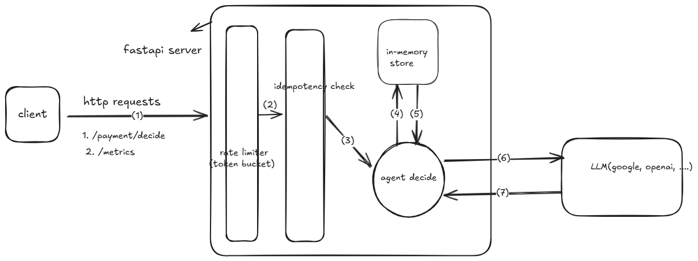

# Backend in FastAPI(Primary) + React/Next.js Frontend(Simple)

## Overview

This project consists of a **FastAPI backend(Primary)** that provides AI-powered payment decision making, and a **simple React/Next.js frontend** that implements the core backend functionalities through an intuitive user interface.

### Backend Features (Primary)
- **AI-Powered Payment Decisions**: Intelligent decision making using Google Generative AI(Code is written but right now using it's alternative similar function orchestrator) with fallback to rule-based logic
- **Payment Processing API**: RESTful endpoint for payment decisions with comprehensive validation
- **Risk Assessment Engine**: Multi-factor risk analysis including balance checks, velocity monitoring, and fraud detection
- **Agent Trace System**: Detailed logging of decision-making steps and tool calls for transparency
- **Rate Limiting & Security**: API key authentication, rate limiting per customer, and input sanitization
- **Idempotency Support**: Prevents duplicate payment processing with unique request tracking
- **Comprehensive Testing**: Full test coverage with pytest for all backend components
- **Performance Monitoring**: Metrics endpoint with P95 latency tracking and request analytics
- **Structured Logging**: Correlation IDs, PII redaction, and detailed audit trails
- **Error Handling**: Graceful fallbacks, retry mechanisms, and detailed error reporting

## How to Run Locally

Follow these steps to set up and run the backend project locally:

1. **Install Dependencies**
   ```bash
   # Navigate to the backend directory
   cd backend

   # Create a virtual environment (optional but recommended)
   python -m venv venv

   # Activate the virtual environment
   # On Windows:
   venv\Scripts\activate
   # On macOS/Linux:
   source venv/bin/activate

   # Install required dependencies
   pip install -r requirements.txt
   ```

2. **Run the Backend Server**
   ```bash
   # Run the FastAPI server
   python -m uvicorn server:app
   ```

3. **Access the API**

   - **The interactive API documentation is available at `http://127.0.0.1:8000/docs` (PREFER THIS FOR SWAGGER PAGE)**.
   - Open your browser or API client (e.g., Postman) and navigate to `http://127.0.0.1:8000`.

4. **Run the Frontend (Optional)**
   ```bash
   # Navigate to the frontend directory
   cd ../frontend
   
   # Install dependencies
   npm install
   
   # Start the development server
   npm run dev
   ```
   
   The frontend will be available at `http://localhost:3000` and will connect to backend API.
   
4. **Sample Curl call**
   ```
      curl -X 'POST' \
         'http://127.0.0.1:8000/payments/decide' \
         -H 'accept: application/json' \
         -H 'x-api-key: secret-test-key' \
         -H 'Content-Type: applicat ion/json' \
         -d '{
         "customerId": "UbWBxZhrcIs4v-2QRVAnCMIdzyaJ8Y1irMDzmn_V2cTBFJGYAG7MBqrVRWOJ3ZmCNw",
         "amount": 400,
         "currency": "USD",
         "payeeId": "o0aoGhgPItHpSbKzpVzePHizB0mW9QfvzljvXXcQ5x",
         "idempotencyKey": "eb343"
         }'
   ```
   #OUTPUT
   ```
      {
         "decision": "block",
         "reasons": [
            "amount_above_daily_threshold",
            "insufficient_balance"
         ],
         "agentTrace": [
            {
               "step": "plan",
               "detail": "Check balance, risk, and limits",
               "timestamp": "2025-08-22T12:40:07.821235"
            },
            {
               "step": "tool:getBalance",
               "detail": "balance=10.00",
               "timestamp": "2025-08-22T12:40:07.821242"
            },
            {
               "step": "tool:getRiskSignals",
		               "detail": "{'recent_disputes': 0, 'device_change': False,  'velocity_check': {'last_24h_count': 0, 'last_24h_amount': 0.0}, 'location_risk': {'unusual_country': False, 'location_mismatch': False}, 'account_risk': {'account_age_days': 365, 'previous_failures': 0, 'suspicious_activity': False}, 'transaction_pattern': {'unusual_time': False, 'unusual_amount': False, 'high_risk_merchant': False}}",
               "timestamp": "2025-08-22T12:40:07.821244"
            },
            {
               "step": "tool:createCase",
               "detail": "case_id=case_bfda08",
               "timestamp": "2025-08-22T12:40:07.821246"
            },
            {
               "step": "tool:recommend",
               "detail": "block",
               "timestamp": "2025-08-22T12:40:07.821250"
            }
         ],
         "requestId": "req_8c76c3"
         }

   ```
---

## How to Run Tests

Follow these steps to run the backend tests:

1. **Navigate to the Backend Directory**
   ```bash
   cd backend
   ```

2. **Activate the Virtual Environment** (if not already activated):
   ```bash
   # On Windows:
   $env:PYTHONPATH = "."
   # On macOS/Linux:
   export PYTHONPATH=.
   ```
3. **Activate the Virtual Environment** (if not already activated):
   ```bash
   # On Windows:
   venv\Scripts\activate
   # On macOS/Linux:
   source venv/bin/activate
   ```

4. **Run the Tests**
   ```bash
   # Run all tests using pytest
   pytest tests/
   ```

5. **View Test Results**
   - The test results will be displayed in the terminal.
   - Use the `-v` flag for more detailed output:
      ```bash
         pytest -v tests/
      ```

---

## Frontend Testing

To run the frontend tests:

1. **Navigate to the Frontend Directory**
   ```bash
   cd frontend
   ```

2. **Run Tests**
   ```bash
   # Run all tests
   npm test
   
   # Run tests in watch mode
   npm run test:watch
   ```

3. **Test Coverage**
   - Tests cover form validation, submission, and result display
   - All components are tested for proper rendering and user interactions
   - 9 comprehensive tests ensure frontend reliability


---

## Architecture Diagram

Below is the architecture diagram for the backend:



The diagram illustrates the flow of requests through the FastAPI server, the decision-making logic, and the integration with external services like Google Generative AI.

---

## What You Optimized

### 1. **Latency**
- Introduced asynchronous processing in FastAPI endpoints to handle I/O-bound tasks efficiently.
- Optimized the `agent_decide` and `agent_decide_ai` functions with retries and fallbacks to ensure faster and more reliable decision-making.
- Reduced redundant computations by caching idempotency keys and frequently accessed data in `store.py`.

### 2. **Simplicity**
- Refactored the `agent_decide_ai` function to include modular retry logic and fallback mechanisms, making the code easier to maintain.
- Consolidated error handling and logging into reusable utilities in `utils.py`.
- Simplified the architecture by using in-memory storage for testing and development, reducing the need for external dependencies.

### 3. **Security**
- Enforced API key validation for all endpoints to restrict unauthorized access.
- Implemented rate limiting in `rate_limiter.py` to prevent abuse and denial-of-service attacks.
- Sanitized user inputs in `models.py` using Pydantic validators to prevent injection attacks.
- Added structured logging for better monitoring and debugging of security-related events.

---

## Trade-offs You Made

### 1. **In-Memory Rate Limiter vs Redis**
- **Decision**: Used an in-memory rate limiter instead of Redis.
- **Reason**: For simplicity and faster development during the initial implementation phase.
- **Trade-off**: While the in-memory rate limiter is sufficient for a single-instance deployment, it does not support distributed systems. Scaling to multiple instances would require replacing it with a Redis-based solution.

### 2. **In-Memory Storage vs Persistent Database**
- **Decision**: Used in-memory storage for customer balances and idempotency keys.
- **Reason**: Simplifies development and testing without requiring database setup.
- **Trade-off**: Data is lost on server restarts, making it unsuitable for production environments. A persistent database like PostgreSQL would be needed for production.

### 3. **Fallback to Non-AI Agent**
- **Decision**: Added a fallback to the non-AI agent in case the AI agent fails.
- **Reason**: Ensures reliability and continuity of service even if the AI model encounters issues.
- **Trade-off**: The fallback logic may not leverage the full capabilities of the AI agent, potentially leading to less optimal decisions.

### 4. **Simplified Security Measures**
- **Decision**: Focused on API key validation and input sanitization.
- **Reason**: Prioritized basic security measures to meet project requirements within the given timeline.
- **Trade-off**: Advanced security features like OAuth2 or JWT-based authentication were not implemented, which may be necessary for production-grade security.

---

## Defense-in-Depth Measures

### 1. **Redacting PII in Logs**
- **Implementation**: Used the `redact_pii` function in `utils.py` to sanitize sensitive information (e.g., customer IDs, payee IDs) before logging.
- **Benefit**: Prevents accidental exposure of personally identifiable information (PII) in logs, enhancing privacy and security.

### 2. **Separating User Display Text from System Reasons**
- **Implementation**: Differentiated between user-facing messages and internal system reasons in the `agent_decide` and `agent_decide_ai` functions.
- **Benefit**: Ensures that sensitive or technical details are not exposed to end users, while maintaining detailed logs for debugging and auditing.

### 3. **Simple Input Validation**
- **Implementation**: Added input validation using Pydantic models in `models.py`.
  - Validated fields like `customerId`, `amount`, and `currency`.
  - Enforced constraints such as minimum/maximum lengths and allowed patterns.
- **Benefit**: Prevents invalid or malicious data from being processed, reducing the risk of errors and security vulnerabilities.

---

## Technical Implementation Notes

### Performance Optimizations
- **P95 Latency Improvements**:
  - Implemented asynchronous endpoints using FastAPI's async/await
  - Added in-memory caching for idempotency keys with TTL
  - Used pre-validation with Pydantic models to fail fast on invalid requests
  - Implemented token bucket rate limiting for better throughput control
  - Metrics endpoint tracks p95 latency: `GET /metrics`

- **Caching Strategy**:
  ```python
  def get_idempotency(self, key: str) -> Optional[Any]:
      if key in self.idempotency and key in self.idempotency_expiry:
          if datetime.now() < self.idempotency_expiry[key]:
              return self.idempotency[key]
  ```

### Security Implementation
- **PII Protection**:
  - Implemented PII redaction in logs:
    ```python
    def redact_customer_id(cid: str) -> str:
        return cid[:2] + "***" + (cid[-2:] if len(cid) > 4 else "")
    ```
  - Configurable PII redaction via `REDACT_PII` setting
  - Sensitive fields identified and masked in structured logging

- **Authentication & Authorization**:
  - API key validation on all endpoints
  - Rate limiting per customer ID
  - Timeout controls for resource locks
  - Input validation and sanitization using Pydantic

### Observability Features
- **Logging**:
  - Structured JSON logging with correlation IDs
  - Log levels configurable via `LOG_LEVEL` setting
  - Automatic traceback capture for errors
  ```python
  structured_log("info", "payment_request_received", {
      "request_id": request_id,
      "customer_id": request.customerId,
      "amount": str(request.amount)
  })
  ```

- **Metrics**:
  - Endpoint: `GET /metrics`
  - Tracks:
    - Total requests
    - Decision counts by type
    - P95 latency
    - Error counts by type

- **Request Tracing**:
  - Correlation IDs for request tracking
  - Agent trace for decision steps
  - Performance timing for operations

### Agent Implementation
- **Tools & Integration**:
  - Implemented tools for:
    - Balance checking
    - Risk signal analysis
    - Case creation
  
- **Retry & Fallback Mechanism**:
  ```python
  def retry_with_fallback(func, *args, max_retries=2, fallback=None):
      for attempt in range(max_retries):
          try:
              return func(*args)
          except Exception as e:
              if attempt < max_retries - 1:
                  time.sleep(1 * (attempt + 1))
      return fallback(*args) if fallback else raise
  ```

- **Guardrails**:
  - Amount validation (0 < amount ≤ 1,000,000)
  - Currency validation (USD, EUR, GBP, JPY)
  - Balance checks before allowing transactions
  - Rate limiting to prevent abuse
  - Transaction timeout controls

These technical implementations ensure robust performance, security, and observability while maintaining clean separation of concerns and proper error handling throughout the system.
	```


-------------------------------------------------------------------------
## Screenshots

All relevant screenshots related to the backend are stored in the `/screenshots` folder.  
You can browse them directly for quick references to API flows, test results, and example input/outputs.


